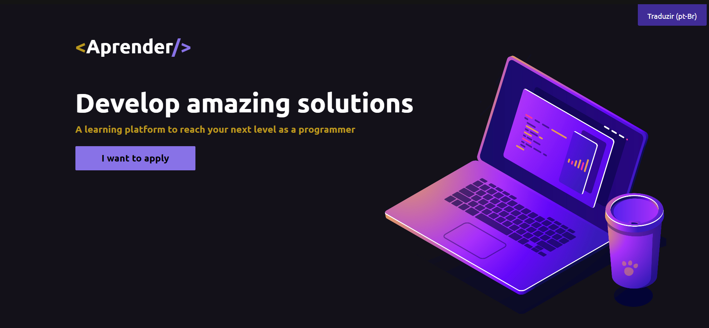
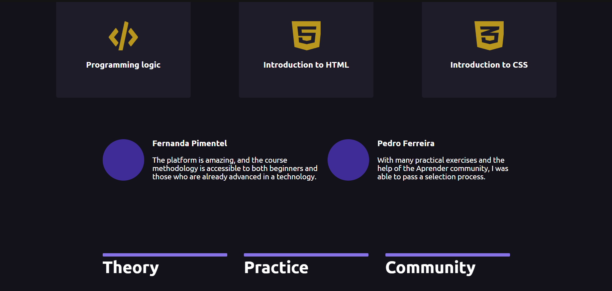
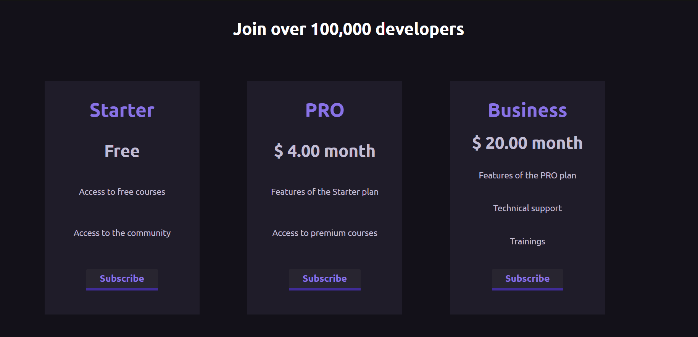

💻<<Aprender/>Aprender/>

Welcome, this is a web application developed in React that serves as a presentation page and invitation to subscribe to study content for web development. In this project, I used only styling libraries known as styled-components.

The Aprender platform page is a frontend application developed to offer subscription plans. The page is divided into three sections: the first features the slogan of the fictional platform, the second is dedicated to showcasing some of the course content and student reviews, and the third and final section provides the subscription options.

This is a free design available on <a href="https://www.figma.com/design/BVMUEIYV68RnTdjCx0Q9cB/Aprender?node-id=10-2&t=8ZSwCBw3cPSUGPGz-0">Figma Community </a>.

##

### Screenshots

